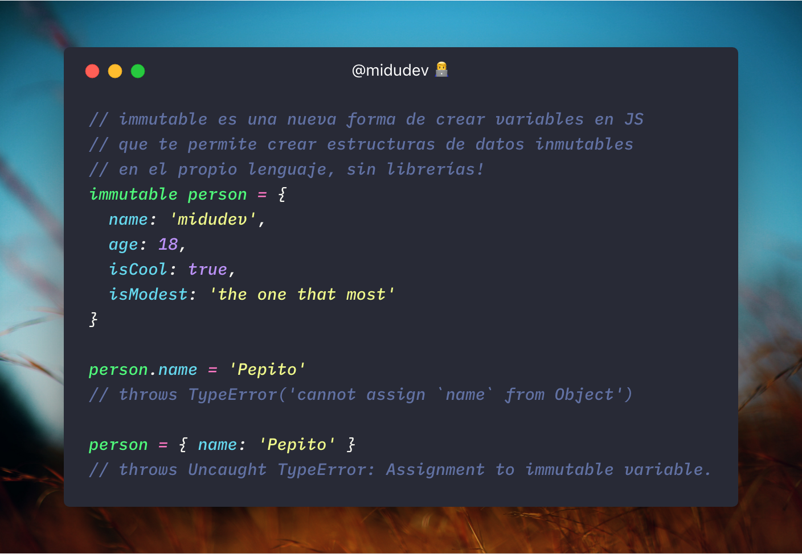

El [comité Ecma TC39](https://github.com/tc39) ha anunciado la creación de un nuevo tipo de variables en Javascript. Se llama `immutable` y viene a satisfacer las necesidades de crear estructuras de datos inmutables en el lenguaje. De esta forma, librerías como [immutable.js](https://facebook.github.io/immutable-js/) dejan de tener sentido y **sólo falta que empecemos a ver los primeros navegadores dando soporte a esta nueva funcionalidad.**



Si quieres saber todos los detalles de esta nueva funcionalidad, **¡sigue leyendo!** 👇

***

<div className='img img-left' alt='Este es el muñequillo típico que te recuerda que has caído en una broma de los Santos Inocentes'>


</div>

## Y lo mejor es que...
**Todo esto es una broma.** 🤪 En España, y en parte de Sudamérica, hoy es el [Día de los Santos Inocentes](https://es.wikipedia.org/wiki/D%C3%ADa_de_los_Santos_Inocentes). **Es una especie de April Fools' Day donde se hacen bromas de todo tipo.** Como dar noticias falsas, pegar un muñeco en la espalda de la gente o [algunas ingeniosas formas de ganarte el odio de la gente.](https://www.levante-emv.com/navidad/2018/12/28/dia-inocentes-2018-mejores-ideas/1814600.html)

Sé que es bastante raro, ya que se supone que es el día donde se conmemora la matanza de los niños menores de dos años en Belén, para intentar asesinar a Jesús, pero en la edad media se juntó con los días de los locos (una especie de [La Purga](https://es.wikipedia.org/wiki/The_Purge) de la época 😅).

Como me imagino que no quieres irte de aquí con las manos vacías, **vamos a ver cómo podríamos conseguir sin librerías en Javascript crear objetos inmutables**, de forma que no se puedan modificar sus propiedades (ni añadir, ni eliminar, ni cambiar de valor).

La mejor forma de crear un objeto que sea inmutable en Javascript es utilizando el método `Object.freeze` de la siguiente forma:

```javascript
const person = Object.freeze({
  name: 'Miguel',
  twitter: '@midudev'
})

// Modificar una propiedad, deja el objeto igual
person.name = 'Pepito' // { name: 'Miguel', twitter: '@midudev' }
console.log(person.name) // 'Miguel'
// Al intentar borrar una propiedad, el objeto sigue igual
delete person.twitter
console.log(person.twitter) // '@midudev'

// Al intentar añadir una propiedad nueva, el objeto sigue igual
person.blog = 'midudev.com'
console.log(person.blog) // undefined
```

Para objetos simples, con un sólo nivel de anidación, `Object.freeze` puede ser suficiente. Sin embargo, el mayor problema que tiene es que no hace que los objetos que podamos tener en nuestro objeto también sean congelados a modificación. Se puede ver con un simple ejemplo:

```javascript
const person = Object.freeze({
  name: 'Miguel',
  twitter: '@midudev',
  address: {
    location: 'El Prat de Llobregat'
  }
})

person.address.location = 'Barcelona'
console.log(person.address.location) // Barcelona
```

Por si os interesa, **podríamos crear una pequeña función que hiciese nuestros objetos inmutables de forma recursiva. **De esta forma, nos aseguramos que también las propiedades que sean objetos de nuestro objeto son inmutables. Eso sí, tened en cuenta que se ha demostrado que `Object.freeze` no es un método muy rápido y que, por lo tanto, para objetos muy complejos, crear estructuras inmutables puede ser costoso. Sólo tenedlo en cuenta.

```javascript
function deepFreeze(object) {
  Object.getOwnPropertyNames(object).forEach(name => {
    const property = object[name]
    // if property is an object, freeze it recursively
    if (property && typeof property === 'object')
      deepFreeze(property)
  })
  // at the end, just return the freezed object
  return Object.freeze(object)
}

// Usamos nuestra nueva función deepFreeeze en un objeto
const person = deepFreeze({
  name: 'Miguel',
  twitter: '@midudev',
  address: {
    location: 'El Prat de Llobregat'
  }
})

// Intentamos sobreescribir el valor location del objeto address del objeto person
person.address.location = 'Barcelona'
// Esta vez, no ha cambiado el valor
console.log(person.address.location) // el Prat de Llobregat
```

Y esto es todo, **si te ha gustado la broma te invito a que la compartas entre tus amigos, compañeros de trabajo y colegas de profesión. ¡A ver si alguno más cae!** 😁 Si no te ha gustado... ¡lo siento! Pero no he podido evitarlo. Espero que no me lo tengás muy en cuenta. 🤣